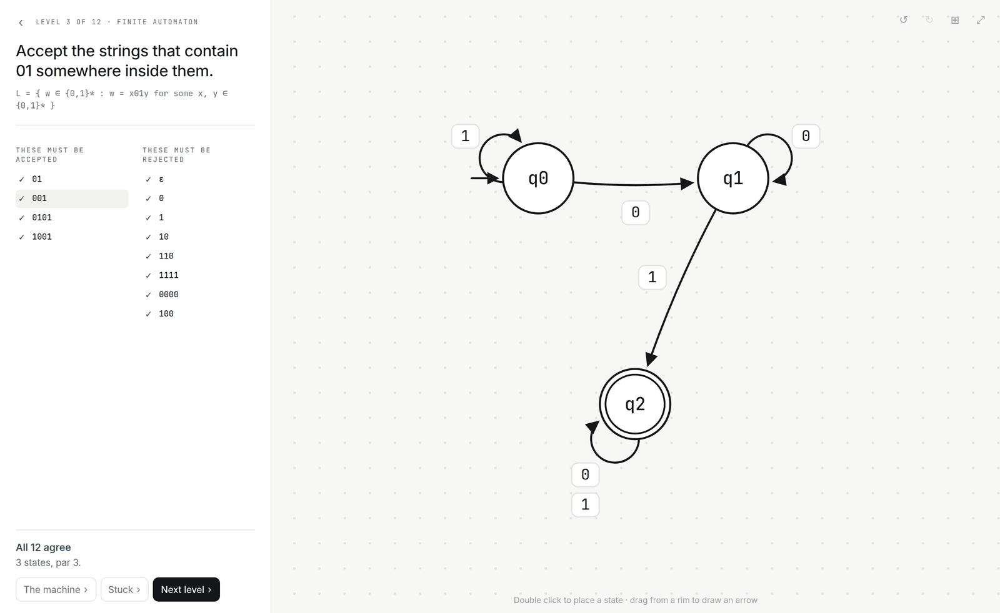
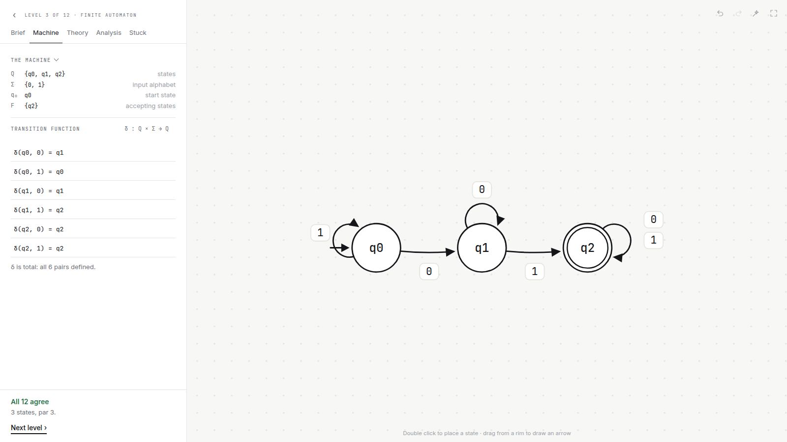
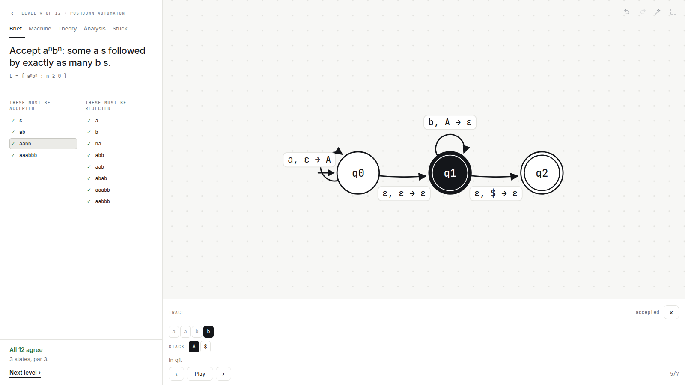

# automata-k

**Draw a machine. It gets graded against the language, not against an answer key.**
Twelve levels climb the Chomsky hierarchy, from finite automata to Turing machines.

[**Play it →**](https://devindyson.com/automata-k/)

[](https://github.com/ddyson1/automata-k/actions/workflows/ci.yml)
[](https://github.com/ddyson1/automata-k/actions/workflows/pages.yml)



## What it is

A puzzle game for formal language theory, and a formal-methods toy underneath.

Each level states a language in plain English and lists the strings that must be
accepted and the strings that must be rejected. Those lists are also the grader:
a tick appears beside a string the moment your machine agrees with it. There is
no results panel and no score to translate into a diagnosis, because the thing
you are reading is the thing that changes.

Nothing anywhere stores an expected verdict. Every level carries an `accepts`
predicate, and both the game and its test suite ask that predicate. A level
whose solution stopped matching its own language would fail the build.

## The twelve

| # | Level | Language | Machine | Type | Par |
|---|-------|----------|---------|------|-----|
| 1 | Last symbol | <code>L = { w ∈ {0,1}* : w ends with 1 }</code> | DFA | 3 | 2 |
| 2 | Parity | <code>L = { w ∈ {0,1}* : &#124;w&#124;<sub>0</sub> is even }</code> | DFA | 3 | 2 |
| 3 | Substring | <code>L = { w ∈ {0,1}* : w = x01y for some x, y ∈ {0,1}* }</code> | DFA | 3 | 3 |
| 4 | Forbidden pair | <code>L = { w ∈ {0,1}* : 11 is not a substring of w }</code> | DFA | 3 | 3 |
| 5 | Empty move | <code>L = { a<sup>i</sup>b<sup>j</sup> : i ≥ 0, j ≥ 0 }</code> | NFA | 3 | 2 |
| 6 | Three blocks | <code>L = { a<sup>i</sup>b<sup>j</sup>c<sup>k</sup> : i, j, k ≥ 0 }</code> | NFA | 3 | 3 |
| 7 | Guess the end | <code>L = { w ∈ {0,1}* : &#124;w&#124; ≥ 3 and the 3rd symbol from the right is 1 }</code> | NFA | 3 | 4 |
| 8 | Brackets | <code>L = { w ∈ {(,)}* : no prefix has more ) than (, and w has equally many of each }</code> | PDA | 2 | 2 |
| 9 | Matching counts | <code>L = { a<sup>n</sup>b<sup>n</sup> : n ≥ 0 }</code> | PDA | 2 | 3 |
| 10 | Mirror | <code>L = { w w<sup>R</sup> : w ∈ {a,b}* }</code> | PDA | 2 | 3 |
| 11 | Cross off | <code>L = { a<sup>n</sup>b<sup>n</sup> : n ≥ 0 }</code> | TM | 2 | 5 |
| 12 | Beyond context free | <code>L = { a<sup>n</sup>b<sup>n</sup>c<sup>n</sup> : n ≥ 0 }</code> | TM | 1 | 6 |

Par is the state count of a verified solution. Levels unlock in order.

## The machine, as a formal object

One disclosure away from the canvas: the defining tuple, the transition
function, a grammar that generates the same language, where the level sits in
the hierarchy, and the analyses. Pointing at a rule lights the arrow it came
from; selecting an arrow lights its rule. On a deterministic class the unwired
pairs are listed in red with a running count.



Analysis will decline rather than guess: a machine that is not a well-formed DFA
has no minimal form, the subset construction does not apply to a stack, and
regular expressions do not describe <code>a<sup>n</sup>b<sup>n</sup></code>. Each says so instead of showing a
number that is wrong.

## Running one

Tapping any string in the brief runs it, and the trace steps through the live
state set, the read head, and whichever extra memory the class has: a stack for
a pushdown automaton, a tape for a Turing machine.



## Playing it locally

```
npm install
npm run dev          # the web app, on a dev server
npm run build        # web/dist, a folder of static files
npm run build:single # web/dist/automata-k.html, one file, opens with file://
```

The built app works from any path a host serves it from, makes no network
requests, and keeps progress in localStorage.

## Publishing it

`.github/workflows/pages.yml` builds `web/dist` and publishes it to GitHub Pages
on every push to `main`, after the full check has passed. It also puts
`automata-k.html`, the whole game in one file, next to the site.

Settings, then Pages, then Source must read **GitHub Actions**. On the other
setting GitHub runs its own Jekyll builder against the same site and publishes
`README.md` rendered as the front page, so the URL answers with the readme
instead of the game. Both deploys go green and the last one finished is the
site, which makes it a coin toss rather than an error. The deploy job therefore
fetches the URL it just published and fails unless the app came back.

Assets are built with `base: './'` so every URL is relative and a project page at
`/<repo>/` works exactly like a domain root, and routing is by hash so no
request ever reaches the server for a path it does not already have a file for.
Pages needs no rewrite rules.

`.github/workflows/ci.yml` runs the same check on every other branch and every
pull request. Both call `verify.yml`, so there is one definition of what passing
means.

## Verifying it

```
npm test             # engine, grammar, geometry and purity suites
npm run typecheck    # tsc --noEmit, strict, on both projects
npm run test:web     # Playwright, desktop and phone viewports
npm run check:swift  # the golden fixture against the Swift declarations
npm run verify       # all of the above
```

Two checks are the definition of done, and both print their counts.

**Engine and solutions.** Every level's verified solution is run against its own
test suite and against every string over its alphabet up to length 6, length 9
for <code>a<sup>n</sup>b<sup>n</sup>c<sup>n</sup></code>, and compared to the level's `accepts` predicate. 31887 strings,
zero mismatches. The suite also asserts each solution's state count equals par.

**Grammars.** Every grammar in the formal layer is derived by breadth-first
search over sentential forms with a length cap, and the generated set is
asserted equal to the level's language over the same range. A single wrong
production shows up immediately, including in the context sensitive grammar for
<code>a<sup>n</sup>b<sup>n</sup>c<sup>n</sup></code>.

Alongside those: validation tests, simulation cap tests, a property test
determinising random NFAs, Hopcroft minimisation against par, state elimination
checked against every level language, arrow geometry pinned by tests rather than
by eye, and 36 Playwright tests over two viewports.

## Layout

```
/src
  /engine        pure TypeScript, zero platform imports
    types.ts     Machine, Transition, Level, Frame, RunResult, caps
    simulate.ts  simulateDFA / simulateNFA / simulatePDA / simulateTM / run
    validate.ts  well-formedness per machine class
    minimize.ts  Hopcroft, reachability, completion, subset construction
    regex.ts     state elimination
    levels.ts    the twelve levels, each with an accepts predicate
    solutions.ts one verified machine per level
    formal.ts    tuple rendering, delta notation, grammars, hierarchy copy
  /ui
    geometry.ts  edge geometry, shared by the web app and its tests
/web             the web app: DOM and SVG, no framework
  /src
    brief.ts     the question, the two lists, and the live marks
    diagram.ts   the canvas
    overlay.ts   the formal layer, over the brief
    ledger.ts    tuple and transition function
    theory.ts    grammar, hierarchy, class, and the hint
    trace.ts     the stepper
    fonts/       the three bundled families, subset from the originals
/ios             the Swift package: the same engine, held to a golden fixture
/scripts         golden fixture, font build, single file build, shape check
/tests           the verification suites, plain Node
/e2e             Playwright web tests
```

The engine is importable by a plain Node script and `tests/purity.test.ts` keeps
it that way: it fails if anything under `src/engine` imports a UI framework or
touches a platform global. The web app is five dev dependencies and no runtime
ones.

## Engine semantics

Epsilon is a distinct symbol constant, never a member of an input alphabet.
Blank is a distinct tape symbol.

**DFA.** Two arrows from one state on the same symbol is a validation error, and
so is any empty move; both are reported rather than simulated. A missing pair is
allowed, behaves as an implicit dead state, and the count is surfaced.

**NFA.** Epsilon closure plus subset simulation. Accepts when the reachable set
meets F.

**PDA.** Stack starts as `["$"]`. A transition reads a symbol or epsilon, pops
one symbol or epsilon, and pushes one symbol or epsilon, the pushed symbol
landing on top. Acceptance is by final state with the whole input consumed.
Breadth-first search over `(state, stack, position)` with a visited set and a
parent map for the trace, capped at 40000 configurations and a stack height of
`2 * input.length + 12`.

**TM.** Single tape, infinite both ways, blank filled. Two arrows on one read
symbol is a validation error. δ is partial: no applicable transition halts and
rejects. Accepts the moment it enters an accepting state. Step limit 4000, after
which the run is reported as non-halting, distinct from a rejection.

Every simulator returns `{ accepted, frames, error?, note?, outcome }`. Frames
are capped at 400 but simulation always runs to the real limit.

## Interface

**The canvas has no dock, and it is the whole right side of the window.** A
state is placed by double clicking. Dragging inside a state moves it; dragging
from the band just outside it pulls an arrow, and the state under the pointer
grows four grips that say so. The state you would land on lights up while you
drag. A state's own controls appear attached to it when it is selected, and an
empty canvas says what to do in the middle of itself.

Four quiet icons in one corner do the things with nothing to attach to: undo,
redo, tidy, fit.

On a phone the canvas is the screen and the brief is a sheet that peeks, showing
the verdict, and pulls up for the lists. Anything that turns attention to the
machine, taking the worked solution or starting a trace, drops it back to
peeking.

## Design

Ink: achromatic, hairline rules, no fills, no shadows. Structure comes from
rules and space. Pass and fail are the only colour in the app, and they are
quiet; a machine that works should feel settled, not congratulated.

Literata for level titles, Inter for interface text, JetBrains Mono for anything
that is machine notation. All three are bundled and cut by
`scripts/build-fonts.py` from the complete originals down to the ranges the app
can draw. 189KB, and δ, ε, Σ and the set-theory symbols are drawn by the
typeface rather than by whatever the system happened to have.

Exponents are written `^n` in source, not with Unicode superscript codepoints.
A type study measured every non-ASCII character the app shows against nine
families and found the superscripts carried by none of them, so both renderers
raise `^x` themselves.

## Rendering

**Arrows.** No SVG markers. Each head is a filled triangle placed at the curve's
tangent so it lands on the target circle with about 3px clearance, at any angle,
distance or bend, and the stroke stops a fixed distance back along the curve
from that tip rather than a fixed distance from the target, which is only the
same thing on a straight edge. Every edge has a slight bend by default and a
wider one when a reverse edge exists. Self loops are true circular arcs aimed by
scoring candidate directions against the state's connections, the walls, and
every other state's disc. Several transitions on one pair stack as separate
chips.

**Drag.** A drag never commits a position per frame. It writes transforms
straight onto the SVG nodes and recomputes the batched edge paths in place; one
commit lands on release, so one undo takes it back.

The canvas grows its visible region from the size of the window in pixels, so a
taller window shows more of the world rather than magnifying the same part of
it, and the grid runs edge to edge because the pane is the canvas. The logical
340 x 460 box is where authored solutions live and what the iOS port shares; on
screen it is only a starting frame, and a drag is bounded by what is visible.

## The Swift port

The TypeScript engine is the proven one. Rather than describe it twice,
`scripts/golden.ts` freezes the proof into `ios/Tests/.../golden.json`: every
level's shape, verified solution and grammar, plus the language itself as a
bitmap over the canonical enumeration of Σ* up to that level's depth, one bit
per string. 31887 bits across 12 levels. `tests/golden.test.ts` regenerates the
fixture and checks it against the live predicate string for string, so a stale
fixture cannot pass, and the Swift tests hold the port to the same bits.

No Swift toolchain is reachable from the environment this was built in, so none
of the Swift has been compiled. `npm run check:swift` is the mitigation
available there: it confirms the fixture's keys and enum values match the
`Codable` declarations. `swift test` on a Mac is the real proof.

## What is not built

Share and import, sandbox mode, and the level editor. Everything above them in
the original list is: minimality feedback, the subset construction viewer,
counterexamples on failure, the regular expression view, dark mode and the
accessibility pass.

The SwiftUI app itself is not written yet. `ios/` contains the engine and its
tests, which is the part that has to be right before any of it is worth drawing.

## Provenance

The build brief referenced a prototype at `/reference/prototype.jsx` as the
behavioural specification. That file was not present in this repository, so the
twelve levels, their verified solutions and the formal-layer copy are authored
to the written spec instead, and proved correct by the suites above.
`levels.ts`, `solutions.ts` and `formal.ts` are isolated, so dropping in the
original content is a contained change followed by a re-run of both checks.

## Constraints kept

No account system, no analytics, no ads, no network calls. Progress stays on the
device behind a single `storage.ts` interface. No paid dependencies.

## Licence

The bundled typefaces are JetBrains Mono, Inter and Literata, all under the SIL
Open Font License 1.1. Their notices travel with them in
[`web/src/fonts/OFL.txt`](web/src/fonts/OFL.txt), and that file has to stay with
any copy of the fonts.

The code has no `LICENSE` file yet. `package.json` declares MIT.
